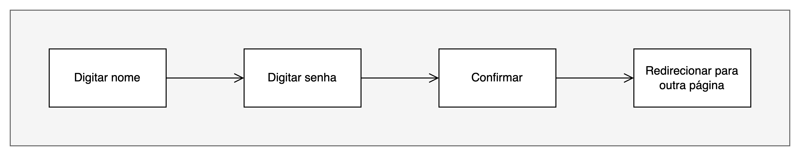
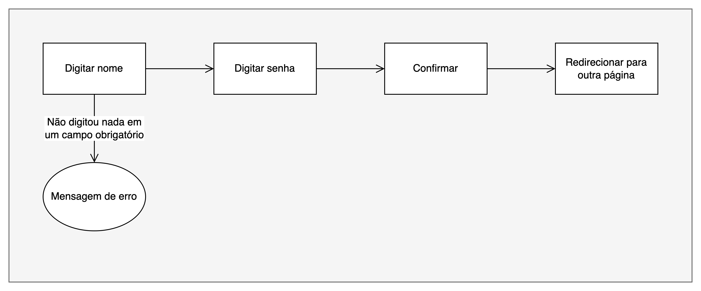
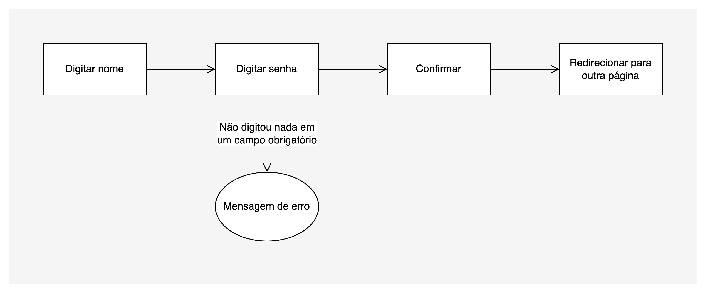
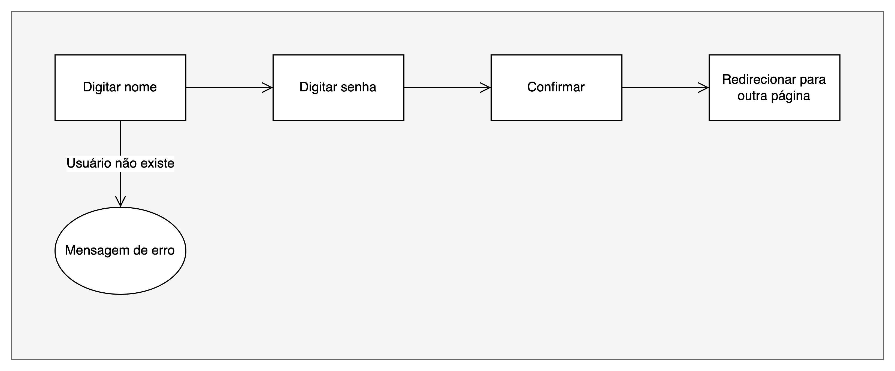
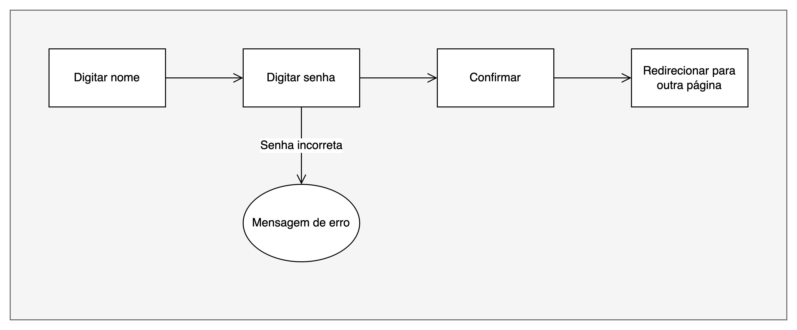
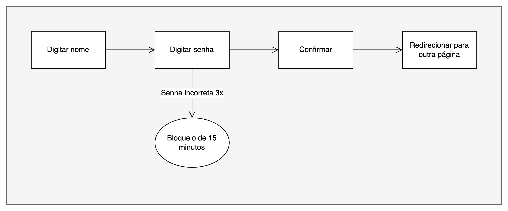

+++
author = "Felipe Santos"
title = "Garantia de Qualidade"
date = "2024-04-18"
description = "Anotações acerca de garantia de qualidade."
tags = [
"qa",
]
categories = [
"qa",
]
+++

# Sumário

- [O que é um teste?](#o-que-é-um-teste)
- [O que é um fluxo de teste?](#o-que-é-um-fluxo-de-teste)
  - [Exemplos de fluxos de teste](#exemplos-de-fluxos-de-teste)
    - [Login bem sucedido](#login-bem-sucedido)
    - [Não digitou nada em um campo obrigatório](#não-digitou-nada-em-um-campo-obrigatório)
    - [Usuário não existe](#usuário-não-existe)
    - [Senha incorreta](#senha-incorreta)
    - [Senha incorreta 3 vezes](#senha-incorreta-3-vezes)

# O que é um teste?

Um teste é um processo utilizado para garantir que um produto ou serviço atenda aos requisitos de qualidade estabelecidos.

# O que é um fluxo de teste?

Um fluxo de teste é uma sequência planejada e estruturada de etapas ou atividades executadas para garantir a qualidade de um produto ou serviço durante o seu desenvolvimento. O objetivo principal de um fluxo de teste é identificar defeitos, problemas ou falhas no ‘software’ e corrigi-los antes que o produto final seja lançado para os usuários.

## Exemplos de fluxos de teste

### Login bem sucedido

### Não digitou nada em um campo obrigatório

### Usuário não existe

### Senha incorreta

### Senha incorreta 3 vezes

